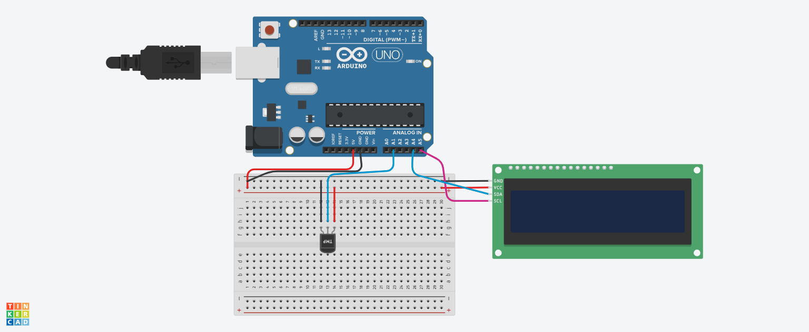

## Projeto: Medidor de Temperatura com Display LCD

Este circuito utiliza um sensor de temperatura e um display LCD para monitorar e exibir a temperatura ambiente.
A comunicação entre o sensor e o Arduino permite que os dados sejam processados e exibidos no display em tempo real.

## Componentes necessários:
 - 1 Arduino Uno
 - 1 Sensor de temperatura (LM35)
 - 1 Display LCD I2C
 - Protoboard e jumpers

## montagem do circuito

## Descrição do Circuito:
- O sensor de temperatura LM35 mede a temperatura ambiente e envia os dados analógicos para o Arduino.
- O display LCD conectado via protocolo I2C exibe a temperatura em tempo real.
- O sensor LM35 tem três pinos: VCC (alimentação), GND (terra) e OUT (saída de tensão correspondente à temperatura).

## Conexões:

1.Sensor de temperatura LM35:
- VCC: Conectado ao pino 5V do Arduino.
- GND: Conectado ao GND do Arduino.
- OUT: Conectado ao pino A0 do Arduino (entrada analógica).

2.Display LCD I2C:
- GND: Conectado ao GND do Arduino.
- VCC: Conectado ao pino 5V do Arduino.
- SDA: Conectado ao pino A4 do Arduino.
- SCL: Conectado ao pino A5 do Arduino.
## Explicação do Código:
1.Leitura do sensor: O valor analógico lido pelo pino A0 é convertido para um valor de temperatura em graus Celsius.
2.Exibição no LCD: A temperatura é atualizada e exibida no display LCD a cada segundo.
## Funcionamento:
- O sensor LM35 envia dados analógicos que o Arduino converte para temperatura em Celsius. O display LCD I2C mostra esses dados em tempo real, facilitando a visualização do ambiente.
