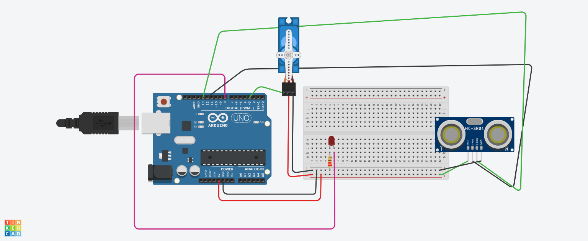

## Projeto: robo 
   ## Introdução
      - Este projeto utiliza um Arduino Uno, um sensor ultrassônico HC-SR04, um LED e um micro servo para medir distâncias 
      - indicar visualmente quando um objeto está próximo e mover o servo conforme a distância medida
      - A montagem é feita em uma placa de ensaio (breadboard) utilizando resistores para proteção dos LEDs e jumpers para conexão dos componentes.
## Componentes Usados
      - Arduino Uno – Microcontrolador utilizado para controlar o sensor, o LED e o servo.
      - Sensor Ultrassônico HC-SR04 – Utilizado para medir a distância.
      - LED – Indica visualmente quando um objeto está próximo.
      - Micro Servo – Movimenta-se conforme a distância medida.
      - Resistor de 220Ω – Protege o LED de correntes excessivas.
      - Placa de Ensaio (Breadboard) – Usada para a montagem do circuito sem necessidade de solda.
      - Jumpers – Fios de conexão para ligar os componentes ao Arduino.
## montagem do circuito

## Conexões
   ## Sensor Ultrassônico:
     - VCC do sensor ao 5V do Arduino.
     - GND do sensor ao GND do Arduino.
     - Trig do sensor ao pino digital 9 do Arduino.
     - Echo do sensor ao pino digital 10 do Arduino.
## LED:
    - Ânodo (perna longa) conectado ao pino 13 do Arduino.
    - Cátodo (perna curta) conectado ao resistor de 220Ω, e este à linha de terra (GND) na breadboard.
## Micro Servo:
   - Fio vermelho (VCC) do servo ao 5V do Arduino.
   - Fio marrom (GND) do servo ao GND do Arduino.
   - Fio laranja (Sinal) do servo ao pino digital 6 do Arduino.
