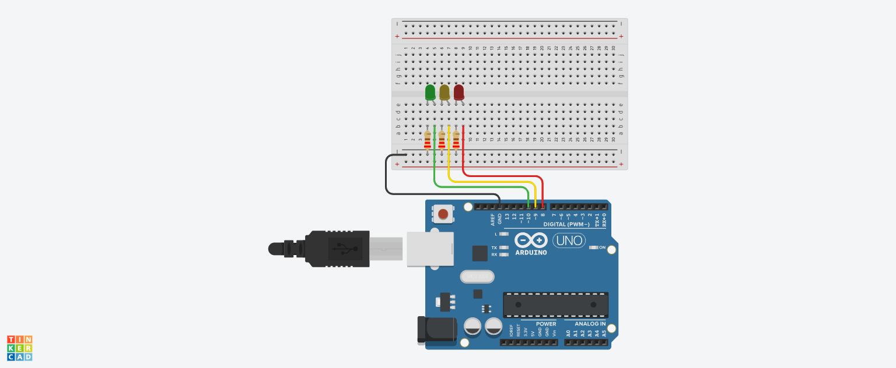

## Projeto: Semáforo com LEDs
- Este projeto utiliza um Arduino Uno para simular um semáforo básico com três LEDs (verde, amarelo e vermelho). Cada LED é conectado ao Arduino e acionado por programação para representar o comportamento de um semáforo. A montagem é feita em uma placa de ensaio (breadboard) utilizando resistores para proteção dos LEDs e jumpers para conexão dos componentes.

## Componentes Usados:
  ## Arduino Uno – Microcontrolador utilizado para controlar os LEDs.
  - 1 LED Verde – Representa o sinal de "siga".
  - 1 LED Amarelo – Representa o sinal de "atenção".
  - 1 LED Vermelho – Representa o sinal de "pare".
  - 3 Resistores de 220Ω – Protegem os LEDs de correntes excessivas.
  - Placa de Ensaio (Breadboard) – Usada para a montagem do circuito sem necessidade de solda.
  - Jumpers – Fios de conexão para ligar os LEDs ao Arduino.
## montagem do circuito

## Conexões:
   - LED Verde:
   - Ânodo (perna longa) conectado ao pino 13 do Arduino.
   - Cátodo (perna curta) conectado ao resistor de 220Ω, e este à linha de terra (GND) na breadboard.
## LED Amarelo:
  - Ânodo conectado ao pino 12 do Arduino.
  - Cátodo conectado ao resistor de 220Ω e depois ao GND.
## LED Vermelho:
  - Ânodo conectado ao pino 11 do Arduino.
  - Cátodo conectado ao resistor de 220Ω e depois ao GND.
## Explicação:
  -Definições dos LEDs: Cada LED está ligado a um pino específico do Arduino: pino 10 para o verde, pino 9 para o amarelo e pino 8 para o vermelho.
  - setup(): Esta função é executada uma vez quando o Arduino é ligado. Aqui, configuramos os pinos dos LEDs como saídas usando pinMode().
  - loop(): Esta função é repetida continuamente após o setup, alternando os LEDs para simular um semáforo.
  - O LED verde acende por 2 segundos, representando o "siga".
  - O LED amarelo pisca por 0.5 segundos, representando o "atenção".
  - O LED vermelho acende por 2 segundos, representando o "pare".
  - O ciclo então repete.
