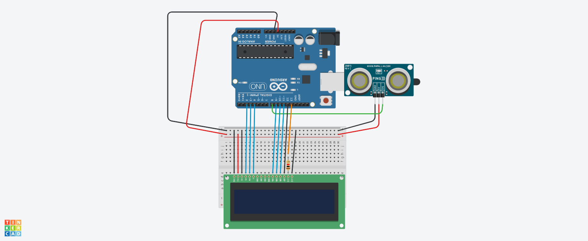

## projeto de tela lcd com sensor de distencia

este projeto foi desenvolvido dento da plataforma do tinkercad, na disciplina de internet das coisas(iot)
(IOT), para a criaçao de um projeto com arduino que simule uma mensagem de mantenha 
distancia toda vez que  algem se aproxime a menos de 1 mentro do sensor.

## componentes usados

* 1 arduino uno
* 1 resistor de 1kΩ
* 1 placa de Ensaio
* 1 sensor de distacia
* 1 tela lcd 16x2
* 14 jumpers macho-macho
* 3 jumpers macho-femea
  
## montagem do circuito

## Explicaçao do codigo 
Incluindo a biblioteca do LCD para controlar displays LCD com o controlador Hitachi HD44780
#include <LiquidCrystal.h>

Criando uma instância do objeto LiquidCrystal, onde os parâmetros representam os pinos conectados ao LCD
#LiquidCrystal lcd(2, 3, 4, 9, 10, 11, 12);

Definindo o pino 13 como a variável para controlar o LED associado ao LCD
#int ledLcd = 13;

 Função que calcula a distância usando sensores ultrassônicos
 Os parâmetros são os pinos para o trigger (emissor) e echo (receptor) do sensor
#long distancia(int trigger, int echo) {
  
   Definindo o pino trigger como saída
  #pinMode(trigger, OUTPUT);
  Inicializando o trigger com estado LOW (baixo) para garantir que não haja ruído
  #digitalWrite(trigger, LOW);
  #delay(5);  Pequena pausa para estabilidade

   Enviando um pulso HIGH (alto) por 10 microssegundos para ativar o sensor
  #digitalWrite(trigger, HIGH);
  #delay(10); 
  #digitalWrite(trigger, LOW);

   Definindo o pino echo como entrada para captar o retorno do som
  #pinMode(echo, INPUT);
  
  Retornando o tempo em microssegundos que o som levou para voltar (com pulseIn)
  #return pulseIn(echo, HIGH);
}

Função de configuração inicial, executada uma vez no início
#void setup() {
   Definindo o pino do LED associado ao LCD como saída
  #pinMode(ledLcd, OUTPUT);
  Ligando o LED do LCD (definindo o pino como HIGH)
  #digitalWrite(ledLcd, HIGH);
  
  Iniciando o LCD, definindo que ele tem 16 colunas e 2 linhas
  #lcd.begin(16, 2);
  #Limpando qualquer informação que esteja no LCD
  #lcd.clear();
}

// Função principal de execução contínua
void loop() {
  Calculando a distância em centímetros com base no retorno do sensor ultrassônico
  #int cm = 0.01723 * distancia(8, 8);  // Fator de conversão para transformar o tempo em distância (cm)

   Se a distância for menor que 100 cm
  #if(cm < 100) {
    #Posicionando o cursor na primeira linha e primeira coluna do LCD
    #lcd.setCursor(0, 0);
    Exibindo a mensagem "Proxima Parada" na primeira linha
    #lcd.print("Proxima Parada ");
    
    // Posicionando o cursor na segunda linha e primeira coluna do LCD
    lcd.setCursor(0, 1);
    // Exibindo a mensagem "Santa Ines, MA" na segunda linha
    lcd.print("Santa ines, MA");
    
  } else {
     Caso a distância seja maior ou igual a 100 cm, limpar o LCD
    lcd.clear();
  }
}
