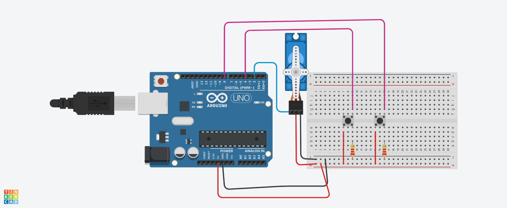

## Projeto: girando_como_os_botoes
Este projeto foi desenvolvido na plataforma Tinkercad, como parte da disciplina de Internet das Coisas (IoT). 
O objetivo é criar um circuito utilizando o Arduino Uno para controlar um micro servo motor com base na interação de dois botões.
## Componentes Usados:
  -  Arduino Uno: Microcontrolador baseado no ATmega328P.
  -  Protoboard: Para montagem dos componentes e conexões.
  -  2 Botões: Utilizados para controlar o micro servo motor.
  -  2 Resistores: Para garantir o funcionamento correto dos botões.
  -  Micro Servo Motor: Atuador controlado pelo Arduino para realizar movimentos precisos.
## montagem do circuito
 
## Explicação do Circuito:
    - Conexões dos Botões: Os dois botões estão conectados aos pinos de entrada digital do Arduino. Cada botão possui um resistor de pull-down para garantir que o estado do pino seja LOW quando o botão não está pressionado.
    - Conexão do Servo Motor: O micro servo motor está conectado a um dos pinos de saída PWM do Arduino, permitindo o controle preciso de sua posição.
    - Alimentação e Terra: O Arduino fornece a alimentação (5V) e a conexão de terra (GND) para todos os componentes através da protoboard.
## Explicação do Código:

## Controle do Servo Motor:
     O servo motor é controlado pelo pino digital 2, que é configurado como saída. A posição do servo é ajustada com base na interação dos dois botões.

## Função de Configuração Inicial (setup()):
   Define o pino do servo como saída e inicializa a posição do servo em 0°. Também configura os pinos dos botões como entradas com pull-up interno.

## Função Principal de Execução Contínua (loop()):
  O programa lê continuamente o estado dos botões e ajusta a posição do servo motor de acordo com as interações:
  - Se o botão de avanço for pressionado, a posição do servo é incrementada até um máximo de 180°.
  - Se o botão de retorno for pressionado, a posição do servo é redefinida para 0°.
