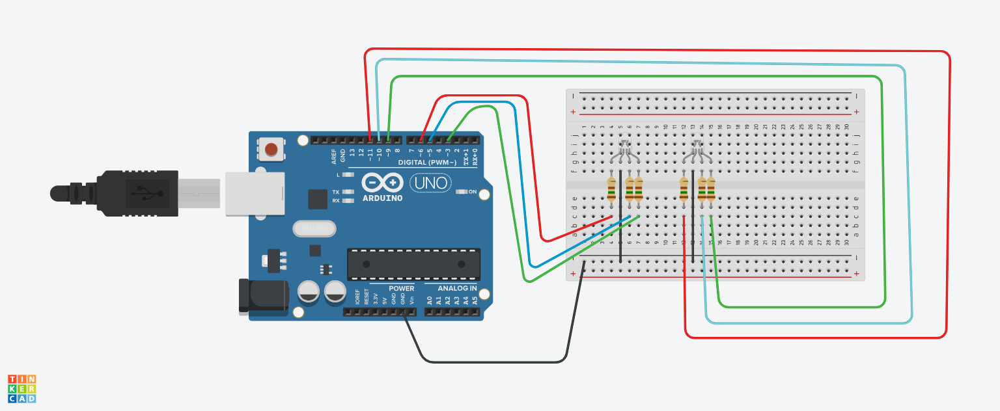

## Projeto: Sistema de Iluminação RGB(pisca pisca)

  - Este projeto foi desenvolvido dentro da plataforma do Tinkercad, na disciplina de Internet das Coisas (IoT), com o objetivo de criar um circuito usando o Arduino Uno que controla dois LED RGB.
  - O sistema utiliza seis sensor LDR (resistor dependente de luz) para monitorar a luminosidade ambiente e ajustar as cores do LED RGB com base na intensidade da luz captada.

## Componentes Utilizados:
   - Arduino Uno – Microcontrolador utilizado para controlar os LEDs.
   - Protoboard – Utilizada para montar o circuito sem a necessidade de solda.
   - 2 LEDs RGB – Cada LED RGB tem quatro terminais: um para cada cor (vermelho, verde e azul) e um terminal comum (cátodo comum ou ânodo comum).
   - 6 Resistores – Resistores para limitar a corrente em cada canal de cor dos LEDs (vermelho, verde e azul).
   - Fios Jumper – Utilizados para realizar as conexões entre o Arduino, a protoboard e os LEDs.
## montagem do circuito
  
## Conexões:
    ## Arduino:

     - Os pinos digitais PWM do Arduino (pinos 9, 10 e 11) estão conectados aos terminais dos LEDs.
     - Pino GND do Arduino está conectado ao barramento negativo da protoboard.
## LEDs:

     - Cada LED RGB possui três pinos conectados aos canais de cores individuais:
     - O pino vermelho (R) de cada LED está conectado ao pino digital PWM 11.
     - O pino verde (G) de cada LED está conectado ao pino digital PWM 10.
     - O pino azul (B) de cada LED está conectado ao pino digital PWM 9.
     - O cátodo comum de cada LED está conectado ao barramento negativo da protoboard (GND), que também está conectado ao GND do Arduino.
## Protoboard:

     - Os terminais de cada LED RGB estão conectados à protoboard, e os resistores estão conectados em série com os pinos RGB para limitar a corrente.
## Funcionamento:
     - O Arduino pode controlar a intensidade de cada cor dos LEDs RGB (vermelho, verde e azul) através dos sinais PWM nos pinos 9, 10 e 11.
     - Alterando a intensidade de cada cor, é possível gerar diferentes combinações de cores nos LEDs.
     - Os resistores estão limitando a corrente para evitar que os LEDs sejam danificados.

