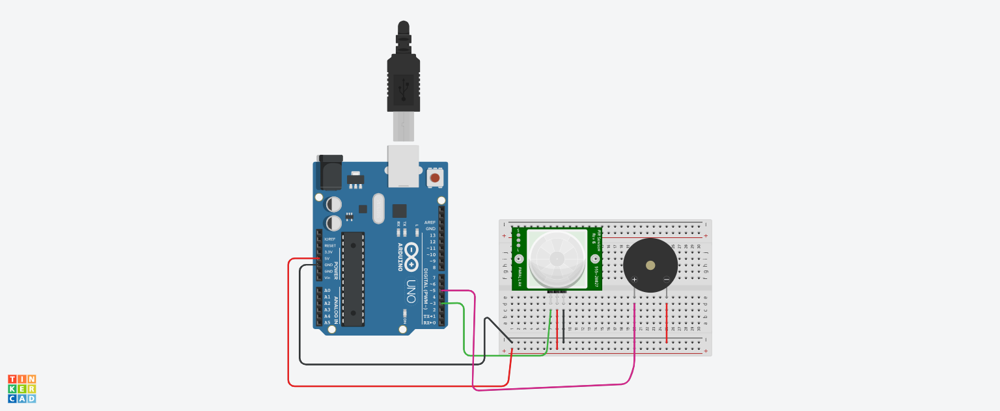

## Projeto: projeto_bizzer_como_sensor_pir
  Este projeto foi desenvolvido dentro da plataforma Tinkercad, na disciplina de Internet das Coisas (IoT)
  com o objetivo de criar um sistema de detecção de obstáculos usando sensores ultrassônicos e um Arduino Uno.
## Componentes Usados:
   -  Arduino Uno: A placa principal que controla o circuito.
   -  Protoboard: Usada para montar o circuito sem a necessidade de solda.
   -  Sensor PIR: Utilizado para detectar movimento.
   -  Buzzer piezoelétrico: Utilizado para emitir sons ou alarmes.
   -  Fios jumper: Conectam os componentes na protoboard ao Arduino.
## montagem do circuito
   
## Explicação do Circuito:
  -  Arduino Uno: A placa principal que controla todo o circuito. Ela é programada para ler os sinais dos sensores e controlar os atuadores.
  -  Protoboard: Usada para montar o circuito de forma prática e sem a necessidade de solda.
  -  Sensor PIR: Detecta movimento. Quando alguém se move na frente do sensor, ele envia um sinal para o Arduino.
  -  Buzzer piezoelétrico: Emite um som quando ativado pelo Arduino, funcionando como um alarme.
  -  Fios jumper: Conectam os componentes na protoboard ao Arduino, permitindo a comunicação entre eles.
## Funcionamento do Circuito:
   - Sensor PIR: Quando detecta movimento, envia um sinal digital ao Arduino.
   - Arduino Uno: Recebe o sinal do sensor PIR e, se o movimento for detectado, ativa o buzzer.
   - Buzzer: Emite um som de alarme para alertar sobre a presença detectada.
## Explicação do Código:
      - Configuração dos Pinos:
           O código define os pinos do Arduino aos quais o sensor PIR e o buzzer estão conectados. O pino do sensor PIR é configurado como entrada, enquanto o pino do buzzer é configurado como saída.
      - Leitura do Sensor PIR:
          O Arduino lê o estado do sensor PIR para verificar se há movimento detectado. Se o sensor detectar movimento, ele enviará um sinal digital ao Arduino.
 ## Acionamento do Buzzer:
          Com base na leitura do sensor PIR, o código controla o buzzer. Se o movimento for detectado, o buzzer emitirá sons alternados de alta e baixa frequência para simular uma sirene. Se não houver movimento, o buzzer será desligado.
## Função de Configuração Inicial (setup()):
          Define os modos dos pinos do sensor PIR e do buzzer como entrada e saída, respectivamente. Esta função é executada uma vez quando o Arduino é ligado ou reiniciado.
## Função Principal de Execução Contínua (loop()):
         O programa lê continuamente o estado do sensor PIR e aciona o buzzer de acordo com a detecção de movimento. Esta função é executada repetidamente em um loop infinito enquanto o Arduino estiver ligado.
