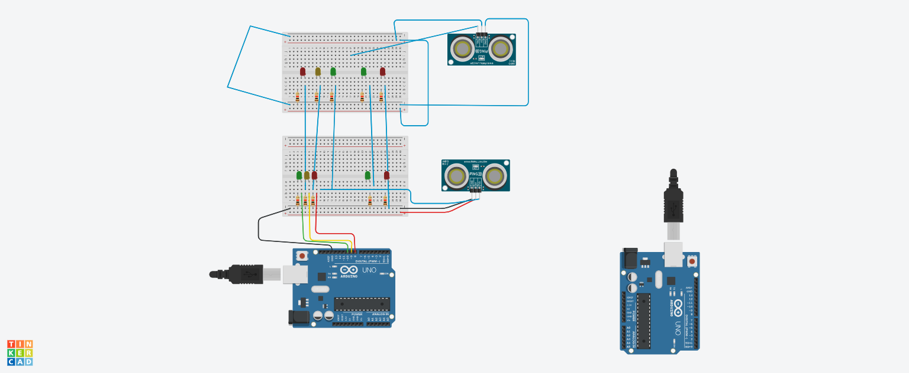

## Projeto: Semáforo Inteligente

Este projeto foi desenvolvido dentro da plataforma Tinkercad, na disciplina de Internet das Coisas (IoT)
com o objetivo de criar um sistema de detecção de obstáculos usando sensores ultrassônicos
LEDs e um Arduino Uno. O sistema acende LEDs de diferentes cores conforme a distância do objeto detectado pelos sensores ultrassônicos.

## Componentes Usados:

- Arduino Uno – Microcontrolador para controle do circuito.
- 2 Sensores Ultrassônicos HC-SR04 – Para medição da distância do objeto.
- 6 LEDs – Para indicar diferentes faixas de distância. Foram utilizados LEDs de cores vermelha, amarela e verde.
- 6 Resistores de 220Ω – Para limitar a corrente dos LEDs.
- 2 Breadboards – Placas de ensaio para montagem do circuito.
- Jumpers – Fios de conexão para ligar os componentes ao Arduino.

## montagem do circuito

## Explicação do Circuito:

- Os sensores ultrassônicos HC-SR04 são responsáveis pela detecção da distância de objetos em frente a eles. Cada sensor utiliza dois pinos de conexão com o Arduino: Trigger e Echo.
- Quando a distância de um objeto muda, diferentes LEDs são acesos, dependendo da faixa de distância detectada.
   - Distâncias curtas acionam LEDs vermelhos.
   - Distâncias intermediárias acionam LEDs amarelos.
   - Distâncias mais longas acionam LEDs verdes.
## Explicação do Código:
  1.Leitura dos sensores ultrassônicos:
    - O Arduino envia um pulso para o pino Trigger do sensor ultrassônico. O sensor então mede o tempo que o som leva para voltar ao pino Echo após refletir em um objeto. Essa leitura é convertida para uma distância em centímetros.
  2.Acionamento dos LEDs:
   - Com base na distância lida pelo sensor, o código controla quais LEDs serão acesos. Se o objeto estiver muito próximo, acenderá o LED vermelho. Para distâncias intermediárias, acenderá o LED amarelo, e para distâncias mais longas, o LED verde.
  3.Função de Configuração Inicial (setup()):
   - Define os pinos dos LEDs e dos sensores como saídas e entradas. A comunicação serial também é inicializada para monitoramento das leituras de distância.
  4.Função Principal de Execução Contínua (loop()):
   - O programa continuamente lê a distância de ambos os sensores ultrassônicos e aciona os LEDs correspondentes de acordo com a faixa de distância medida.
