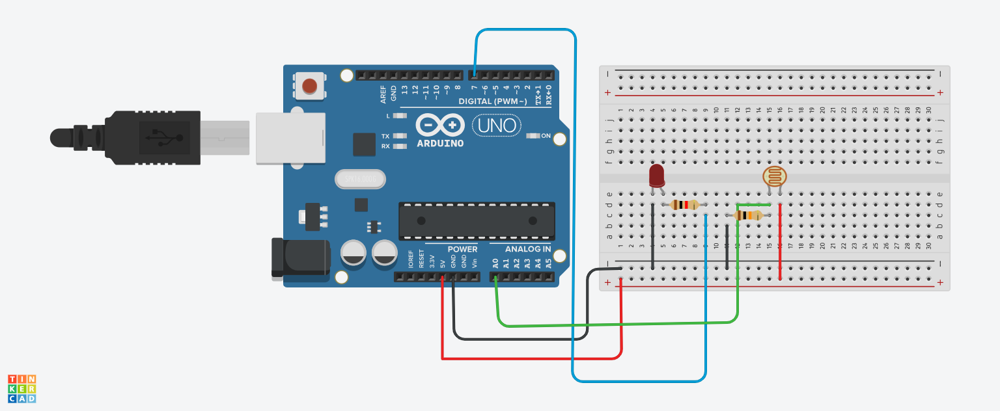

## Projeto: Sensor de Luminosidade

Este projeto foi desenvolvido dentro da plataforma do Tinkercad, na disciplina de Internet das Coisas (IoT),
com o objetivo de criar um circuito usando o Arduino Uno que monitore a luminosidade e acione um LED com base na intensidade da luz captada por um sensor LDR (resistor dependente de luz).

## Componentes Usados:

## Arduino Uno – Microcontrolador para controle do circuito.
-  1 Resistor de 10kΩ – Para limitar a corrente no circuito do LDR.
-  1 Resistor de 220Ω – Para limitar a corrente no LED.
-  1 LDR (Light Dependent Resistor) – Sensor de luminosidade que varia sua resistência de acordo com a luz incidente.
-  1 LED – Indicador que será acionado conforme a leitura do LDR.
-  1 Placa de Ensaio (Breadboard) – Para montagem do circuito sem a necessidade de solda.
-  Jumpers – Fios para conexão entre os componentes e o Arduino.

## montagem do circuito

## Explicação do Circuito:
O LDR está conectado ao pino analógico A0 do Arduino, onde a variação da resistência, dependendo da quantidade de luz ambiente, gera um sinal analógico.
O LED está conectado ao pino digital 7 do Arduino, e será acionado com base nas leituras da luminosidade.
Dois resistores estão conectados no circuito para garantir que a corrente esteja adequada tanto para o LED quanto para o LDR.
O Arduino processa a leitura do sensor de luminosidade e aciona o LED dependendo do valor lido.

## Explicação do Código:
Leitura do sensor de luminosidade (LDR):

A função analogRead(A0) captura os valores do LDR, que variam de acordo com a luz ambiente. Um valor baixo indica pouca luz, enquanto valores altos indicam muita luz.
Acionamento do LED:

O LED é controlado pelo pino digital 7, que é configurado como saída. Se a leitura do LDR for inferior a um determinado valor (exemplo, luz fraca), o LED é aceso. Caso contrário, o LED permanece apagado.
Função de Configuração Inicial (setup()):

Define o pino do LED como saída e inicializa a comunicação serial para monitoramento dos dados de luminosidade no console.
Função Principal de Execução Contínua (loop()):

O programa lê continuamente o valor do sensor de luminosidade, exibe o valor na tela do console, e controla o estado do LED de acordo com a intensidade de luz.
